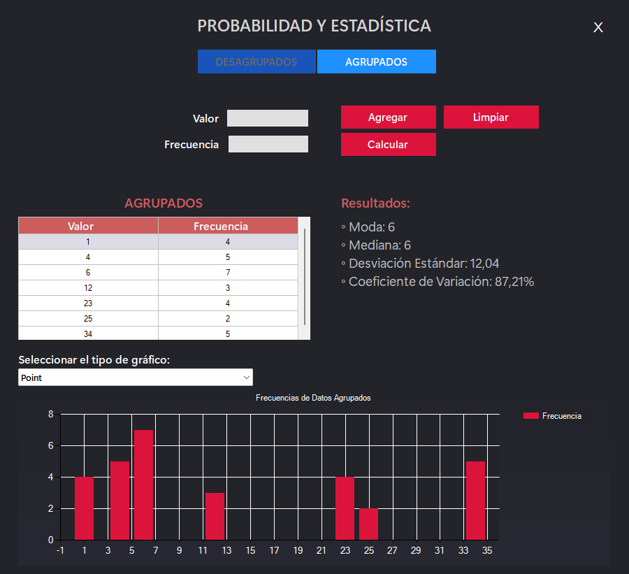

Este proyecto es una aplicación de Windows Forms que permite calcular y visualizar estadísticas básicas de conjuntos de datos. La aplicación admite tanto datos agrupados como desagrupados y presenta estadísticas como la media, mediana, moda, desviación estándar y coeficiente de variación. También incluye gráficos para una representación visual de los datos.

## Funcionalidades

- **Ingreso de datos**: Permite al usuario ingresar datos desagrupados y agrupados a través de una interfaz gráfica.
- **Cálculo de estadísticas**:
  - Media
  - Mediana
  - Moda
  - Desviación estándar
  - Coeficiente de variación
- **Visualización de datos**: Representa los datos en gráficos de diferentes tipos (columnas, líneas, etc.) para una mejor comprensión.
- **Interfaz intuitiva**: Diseñada con Windows Forms, es fácil de usar y accesible.

## Requisitos

- .NET Framework (versión X.X o superior)
- Visual Studio (recomendado para desarrollo)

## Instalación

1. Clona el repositorio:

   ```bash
   git clone https://github.com/tu_usuario/proyecto-probabilidad-estadisticas.git
